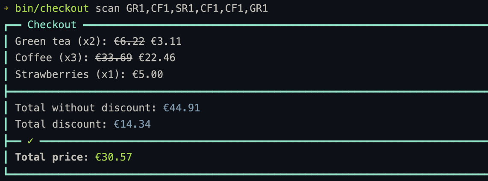

# Cash Register

This is a simple cash register application that allows you to scan items, apply discounts, and calculate the total price.

## Architecture Overview

For a detailed overview of the architecture, please refer to the [ARCHITECTURE.md](docs/ARCHITECTURE.md) file.

## Requirements

- Ruby 3.4+
- Bundler

## Installation

1. Clone the repository:

```bash
git clone https://github.com/fvioz/cash_register.git
```

2. Navigate to the project directory:

```bash
cd cash_register
```

3. Install rbenv and set the Ruby version:

```bash
rbenv install 3.4.4
rbenv local 3.4.4
```

4. Install dependencies:

```bash
bundle install
```

## Running Tests

To run the test suite, use the following command:

```bash
bin/rspec
```

## Usage

You can use the application either via the command line interface (CLI) or through an interactive console.

### Via the Command Line Interface (CLI)

```bash
bin/checkout scan GR1,CF1,SR1,CF1,CF1,GR1
```

This will output the total price after applying any relevant discounts.



### Via Console

```bash
bin/console
```

Then, in the console:

```ruby
# Initialize pricing rules
pricing_rules = Discounts::PricingRulesService.new

# Create a checkout instance with the pricing rules
checkout = Checkouts::CheckoutService.new(pricing_rules)

# Scan items
checkout.scan('GR1')
checkout.scan('GR1')

# Print total
puts Money.from_amount(checkout.total, 'EUR').format
```
